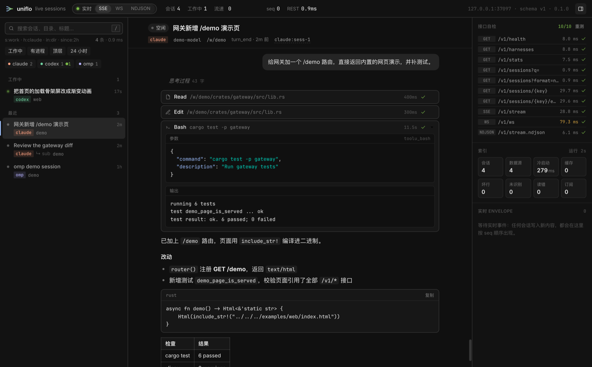
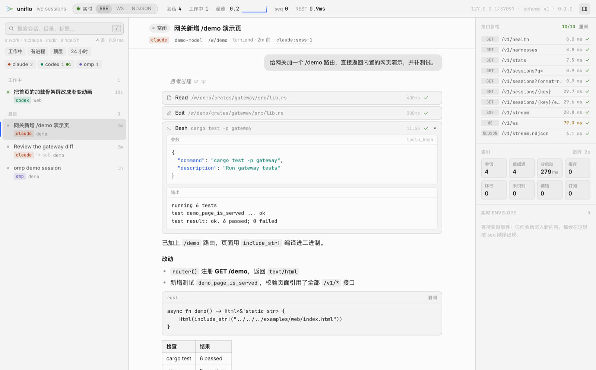

# Uniflo

> 一个本地守护进程，把机器上所有 AI coding agent（Claude Code、Codex、omp、OpenCode、Gemini CLI…）的会话实时归一成一套格式，通过本地网关供桌面端 / 网页端直接接入。



## 为什么

每个 agent harness 都把会话存成自己的格式：JSONL、整份 JSON、SQLite，字段、回合标记、子代理布局各不相同。想做一个"看所有 agent 在干什么"的面板，就得写 N 套解析、处理流式改写、自己判断谁在工作。

Uniflo 只做这一层：

- **统一格式**：`Session` + `Event`（`user_message` / `assistant_message` / `reasoning` / `tool_call` / `tool_result` / `turn_start` / `turn_end` / `usage` / `system`），一套解析对接全部 harness。见 [`docs/schema.md`](docs/schema.md)。
- **两态**：每个会话只有 `work` 和 `idle`，规则统一，结合进程存活与超时。
- **实时**：文件追加到客户端收到事件通常在 10–50 ms；SSE、NDJSON、WebSocket 三种传输，带全局 `seq` 断线续传。
- **毫秒级查询**：头尾摘要 + 游标跟随 + 索引缓存；本机 5600+ 会话、1.8 GB 数据，有缓存时启动约 0.2 s，REST 请求个位数毫秒。
- **fd / fzf 式搜索**：`s:work h:claude in:uniflo since:2h 'gateway`。见 [`docs/search.md`](docs/search.md)。
- **只读、只听本机**：从不写 harness 数据；网关校验 Host / Origin，可选 token。

## 已支持的 harness

Claude Code、Qoder、Qwen Work、Codex、Pi、oh-my-pi、Crosery Agent、Command Code、Prime Agent、Cline、Roo Code、Kodu、Gemini CLI、Antigravity、OpenCode、Kilo Code、ZCode、MiMo Code、WorkBuddy、MiniMax Code、Hermes、Factory Droid、Reasonix、Cursor Agent —— 共 24 个，存储位置与回合信号见 [`docs/adapters.md`](docs/adapters.md)。

## 安装与快速开始

### 安装

```sh
# 方式 1：通过 crates.io 安装
cargo install uniflo

# 方式 2：直接通过 GitHub 安装最新预发布版
cargo install --git https://github.com/Crosery/uniflo.git uniflo

# 方式 3：从源码安装
git clone https://github.com/Crosery/uniflo.git && cd uniflo
cargo install --path crates/uniflo-cli
```

### 启动服务

```sh
uniflo daemon                             # 前台启动网关，默认 http://127.0.0.1:7311
open http://127.0.0.1:7311/demo           # 打开内置网页演示

# macOS 可一键安装 launchd 后台常驻服务（登录自启、静默运行）
scripts/install-service.sh
```

CLI（有守护进程时连它，否则 `--local` 进程内索引）：

```sh
uniflo harnesses                          # 每个 harness 的会话数 / 工作中数量
uniflo ps                                 # 正在工作的会话
uniflo find "h:omp in:geek since:1d"      # 结构化过滤 + 模糊匹配
uniflo show claude:4f1c                   # 会话详情（key 前缀即可）
uniflo tail claude:4f1c -f                # 跟随一个会话的事件
uniflo watch --kinds tool_call            # 全局实时事件流
uniflo ls --tsv -n 500 | fzf              # 接 fzf
```

## 接入自己的应用

```js
const api = "http://127.0.0.1:7311";
const res = await fetch(`${api}/v1/sessions?q=s:work`);
const seq = res.headers.get("x-uniflo-seq");          // 快照对应的序号
render(await res.json());

const es = new EventSource(`${api}/v1/stream?since=${seq}`);   // 从快照之后无缝续上
es.addEventListener("session", (m) => upsertSession(JSON.parse(m.data).session));
es.addEventListener("event", (m) => upsertEvent(JSON.parse(m.data).event)); // 同 id 覆盖 = 流式更新
```

完整接口见 [`docs/api.md`](docs/api.md)。

## 网页演示

[`examples/web/index.html`](examples/web/index.html) 是一个零依赖、免构建的单文件客户端，守护进程直接在 `/demo` 提供，也可以复制出去改造：

- 左侧：fd/fzf 式搜索、harness 过滤、按「工作中 / 最近」分组的会话列表（状态点、子代理、存活进程）。
- 中间：归一后的会话流——用户气泡、Markdown 回复（代码块可复制）、折叠的思考、一行一个的工具调用（参数 + 输出 + 耗时 + 状态），按回合汇总 token。
- 右侧：10 个接口的实时自检与延迟、索引健康度、实时 Envelope 流。
- 顶栏切换 SSE / WebSocket / NDJSON；跟随系统明暗主题；`/` 搜索，`j` `k` 切换会话。
- URL 参数：`?api=http://127.0.0.1:7311`（从其他本地端口打开时）、`?token=`、`?transport=ws`、`?select=<key>`、`?redact`（模糊所有正文，便于录屏）。

`scripts/demo-e2e.mjs` 用无头 Chrome 对它做端到端验收（合成数据，不碰真实会话）：三种传输、全部接口、实时追加延迟、work/idle 切换、跨域接入与 token。



## 项目结构

```text
crates/
  uniflo-schema    wire 类型（唯一对外契约）
  uniflo-core      适配器 trait、JSONL 驱动、状态机、引擎、缓存、监听、进程探测
  uniflo-search    查询语法 + 模糊排序
  uniflo-adapters  每个 harness 一个模块 / 一个 cargo feature
  uniflo-gateway   REST / SSE / NDJSON / WebSocket + Host/Origin/token 守卫
  uniflo-cli       uniflo 二进制
examples/web       网页演示（同时由守护进程在 /demo 提供）
docs/              架构、契约、规范、决策记录
```

设计说明见 [`docs/architecture.md`](docs/architecture.md)，决策见 [`docs/decisions/`](docs/decisions/)。

## 开发

```sh
scripts/verify.sh          # fmt + clippy -D warnings + 每个适配器 feature 单独编译 + 全量测试
scripts/verify.sh --e2e    # 再用无头 Chrome 跑一遍网页演示（需要 bun + Chrome）
```

开发规范：[`docs/conventions/DEVELOPMENT.md`](docs/conventions/DEVELOPMENT.md)；agent 协作规范：[`AGENTS.md`](AGENTS.md)。新增 harness：[`docs/adapters.md`](docs/adapters.md)。

## 许可

MIT
